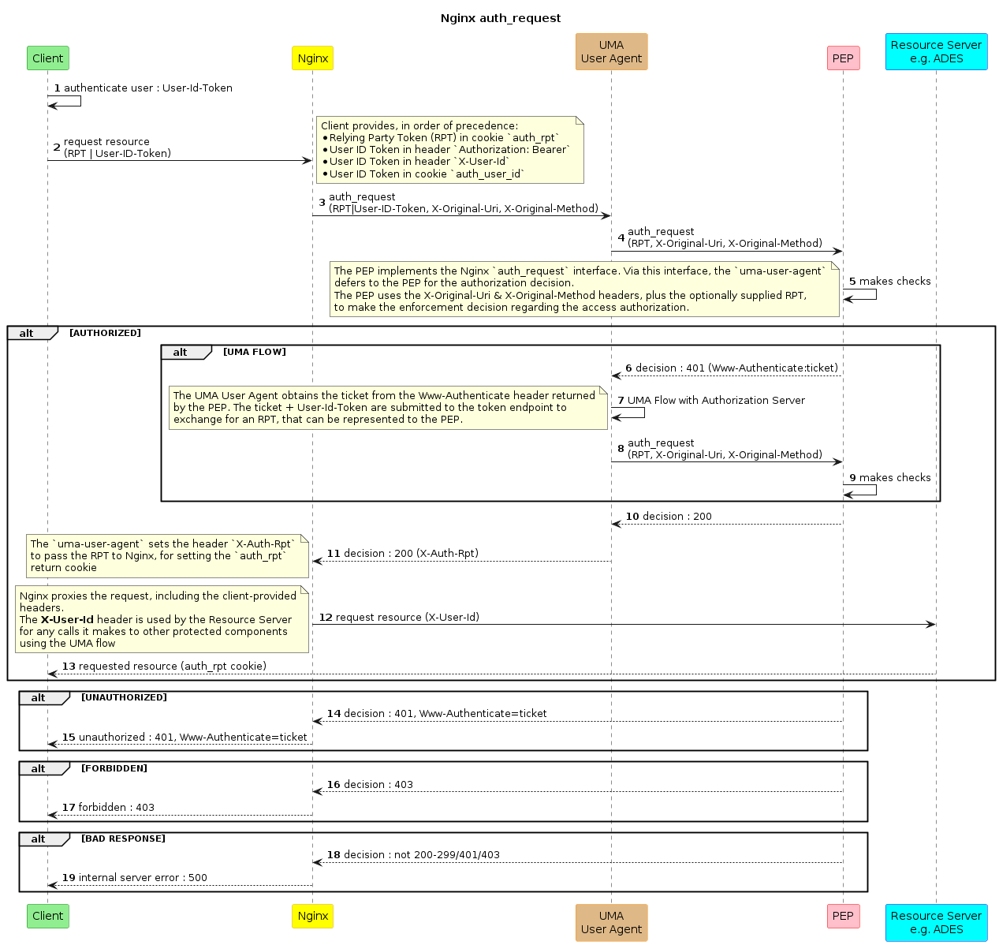

# Resource Guard

## Description

The Resource Guard provides protection of a _Resource Server_ by application of two sub-components:

* [**UMA User Agent**](uma-user-agent.md) 
  Integrates with nginx by providing an `auth_request` endpoint through which nginx reverse-proxy (ingress controller) can obtain authorization before proxying a request. 
  Defers to the PEP for the policy enforcement. The UMA User Agent acts as a UMA client in its interactions with the PEP, and interfaces to the _Token Endpoint_ of the system _Authorization Server_ to follow the UMA flow.

* [**Policy Enforcement Point (PEP)**](pep.md) 
  Integrates with the `UMA User Agent` by providing an `auth_request` endpoint through which the UMA User Agent can obtain authorization as a UMA client.
  The PEP integrates with the system _Authorization Server_ to engage in the UMA flow.

Both the UMA User Agent and the PEP offer an HTTP interface in accordance with the nginx module [`ngx_http_auth_request_module`](https://nginx.org/en/docs/http/ngx_http_auth_request_module.html). The authorization flow chains `nginx -> UMA User Agent -> PEP`, as illustrated in the following sequence diagram.

Thus the Resource Guard is deployed as a `UMA User Agent`/`Policy Enforcement Point` pair that have been coherently configured to protect a given _Resource Server_.

For more information see the descriptions of the [UMA User Agent](uma-user-agent.md) and [Policy Enforcement Point](pep.md).

## Interfaces

See the interface specifications for the [UMA User Agent](uma-user-agent.md#interfaces) and [Policy Enforcement Point](pep.md#interfaces).

## Dependencies

The Resource Guard is an 'umbrella' component that comprises and so entirely depends upon the [UMA User Agent](uma-user-agent.md) and [Policy Enforcement Point](pep.md).

## Usage

The Resource Guard is deployed using the [helm chart](https://github.com/EOEPCA/helm-charts/tree/main/charts/resource-guard) that is available at the [EOEPCA Helm Chart Repository](https://eoepca.github.io/helm-charts).
