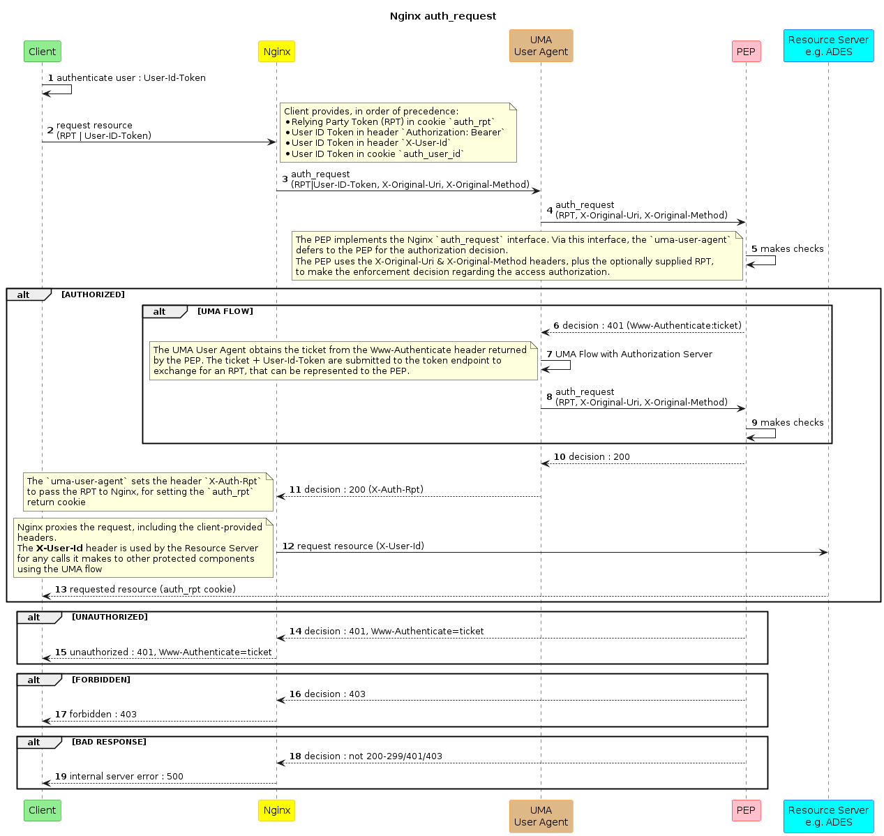

# UMA User Agent

## Description

The _UMA User Agent_ implements a UMA (User Managed Access) client to obtain an access token on behalf of the end-user.

All access attempts to a Resource Server, (e.g. Catalogue, Data Access, ADES, etc.), are subject to the policy enforcement of the PEP (Policy Enforcement Point). For reasons of performance, it is desirable for Nginx to act as the reverse-proxy in this protection flow, rather than the proxy function of the PEP which is not designed for large numbers of concurrent requests or large data volumes.

Through the [Module ngx_http_auth_request_module](https://nginx.org/en/docs/http/ngx_http_auth_request_module.html), Nginx provides a mechanism in which its reverse-proxy function can defer the authorization decision to a subrequest, and so offer protected access. Hence, this `auth_request` interface offers a means to invoke the services of the PEP, whilst maintaining proxy performance.

The `auth_request` approach invokes the subrequest with the expectation to receive one of three possible responses: `2xx (OK)`, `401 (Unauthorized)`, `403 (Forbidden)`. Only 2xx (OK) `auth_request` responses will permit the onward proxy of the request. Otherwise the `401`/`403` response is returned to the client.

In order to inform its decision the PEP is provided with pertinent request information through http headers set by nginx in the subrequest: `X-Original-Method` (http method of client request); `X-Original-Uri` (path to the requested resource).

The PEP implements the nginx `auth_request` interface and so returns `2xx`, `401` or `403`. In the case of a `401` response, then the PEP expects the client to follow the UMA (User Managed Access) flow, using the `ticket` that is provided in the `Www-Authenticate` header it returns with the `401` response.

A typical client, such as a browser, is not in a position to follow the UMA flow. Thus, the _UMA User Agent_ performs the role of UMA client on behalf of the end-user client (user agent). The _UMA User Agent_ sits between nginx and the PEP, to intercept the PEP `401` responses (with `Www-Authenticate` header) to follow the UMA flow, exchanging a `ticket` for an RPT (Relying Party Token), which can then be re-presented to the PEP and so gain authorization.

This flow, and the chaining of the _UMA User Agent_ -> PEP in the nginx `auth_request` subrequest, is illustrated in the following sequence diagram.

## Interfaces

### HTTP Request

The _UMA User Agent_ supports the following inputs on the http subrequest from nginx:

**http headers**

* `X-Original-Method`: http method of client request
* `X-Original-Uri`: path to the requested resource
* `Authorization`: carrying `Bearer` token for user ID (optional)
* `X-User-Id`: user ID token from OIDC (optional)

**http cookie**

* `auth_user_id`: user ID token from OIDC (optional) 
  _Cookie name is configurable_
* `auth_rpt-<endpoint-name>`: RPT from previous successful access (optional) 
  _Cookie name is configurable_

**User ID Token**

There are three means through which the User ID Token (from OIDC) can be presented to the _UMA User Agent_. 
These are **in priority order**:

1. `Authorization` header as a bearer token - in the form: `Authorization: Bearer <token>`
2. `X-User-Id` header
3. `auth_user_id` cookie (name of cookie is configurable)

### HTTP Response

The _UMA User Agent_ sets the following headers in the http response:

* **Response `2xx (OK)`**:
    * `X-User-Id`: user ID token, to be passed-on to the target _Resource Server_
    * `X-Auth-Rpt`: RPT from successful authorization
    * `X-Auth-Rpt-Options`: cookie options for RPT
* **Response `401 (Unauthorized)`**:
    * Www-Authenticate: defines http authorization methods
* **Response `403 (Forbidden)`**: 
    _No specific headers_

### OpenAPI Document

TBD

## Dependencies

The _UMA User Agent_ integrates with:

* **nginx** 
    Nginx is configured via its `auth_request` module to invoke the _UMA User Agent_ before allowing the request.
* **PEP** 
    The _UMA User Agent_ relies on the PEP to provide the enforcement decision. This is achieved by chaining the `auth_request` to the PEP.
* **Authorization Server** 
    The _UMA User Agent_ follows the UMA flow by interfacing with the token endpoint of the Authorization Server that is identified in the response received back from the PEP.

## Additional Information

> Describe the configuration of the agent binary, and the configuration of nginx.
